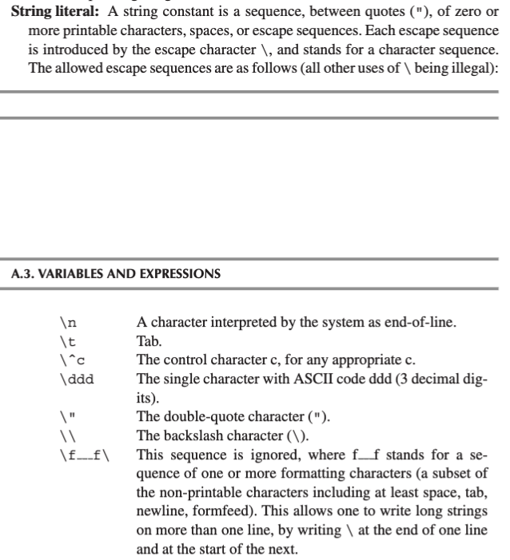

## Points

### How to handle comments?

Because Tiger allows comments to be nested with arbitrary levels, no simple DFA can recognize it. Generally, a push-down automata can recognize it.

In this lab, we can just record the nested level of the scanning comment. Each time we meet a `/*`, the nested level increases; or a `*/`, the nested level decrease. The mini-scanner for the comment stops if and only if `_comment_level == 1`. If the scanner meets the end of file before it decrease the nested level to 1, then the lexer throws an error.

### How to handle strings?

It's the most annoying part of this lab. The string literal of Tiger language is complicated. Here is a review:



There are some details worth noting:

- Handle different escape sequences, including recognizing and transforming
- Adjust the position of the current token

To achieve these, I use two temporary variables: `string_buf_` and `string_buf_act_len_`. The `string_buf_` stores the recognized string literal after transforming, if any escape sequence appears. The `string_buf_act_len_` records the actual length of the string literal. Typically, `string_buf_.length() <= string_buf_act_len_` since the possible existence of escape sequences.

When a `"` is recognized, the mini-scanner `<STR>` launches. During the `<STR>` mode, when a `\` is recognized, the mini-scanner `<STR_ESCAPE_SEQ>` launches. And to match the last kind of escape sequences `\f___f\`, when a formatting character is recognized during the `<STR_ESCAPE_SEQ>` mode, the mini-scanner `<IGNORE>` launches. The error handling is trivial.

Note that the surrounding double quotes should be dropped.

### error handling

I define a macro `_LEXER_ERROR` to emit the error during scanning. When a error occurs, the lexer report the position of the wrong token, and exits with status code 1.

### end-of-file handling

Generally we don't have to treat it exclusively. One exception is that meeting EOF during `<COMMENT>` mode. It's an error. (If the lexer doesn't exit, the program will fall into an infinite loop. It looks like a vulnerability of Flexc++.)

### other interesting features of your lexer

AFAIK, no.

## Reference

The mini-scanner feature of Flexc++ is important for this lab.

- [Flexc++ mini scanners](https://fbb-git.github.io/flexcpp/manual/flexc++03.html#STARTCONDITIONS)

## Compliant

The lexer must be built with **Flexc++ v2.06.x and Bisonc++ v6.01.00**. Note that only Bisonc++ v6.01.00 is supported, even v6.01.03 doesn't (the author of Bisonc++ made breaking changes when bumping the PATCH version, which violated [Semantic Versioning](https://semver.org/) 😅). Besides, the experience of building the two libraries from source code is a complete disaster!

Why does the new version fail? From [the changelog of Flexc++](https://fbb-git.gitlab.io/flexcpp/changelog.txt):

```
flexc++ (2.07.00)

  * Nested namespace specifications (like my::nested::ns) cannot be used in
    include-guard specifications. In those cases only the alpha-numeric
    characters and the underscore of the namespace are used (thanks, avalchev,
    for bringing this to my attention).

  * Since identifiers having series of two or more underscores are reserved by
    the C++ standard, all identifiers ending in two trailing underscores were
    redefined as identifiers ending in a single underscore. This involves the
    enums
        ActionType_, Leave_, StartConditon_, PostEnum_,
    the members
        actionType_, continue_, echoCh_, echoFirst_, executeAction_,
        getRange_, get_, istreamName_, lex_, lop1_, lop2_, lop3_, lop4_,
        lopf_, matched_, noReturn_, print_, pushFront_, reset_, return_,
        state_, switchStream_, updateFinals_,
    and the protected data members
        d_in_ d_token_ s_finIdx_, s_interactive_ s_maxSizeofStreamStack_,
        s_nRules_, s_rangeOfEOF_, s_ranges_, s_rf_.
    Existing code using the previously defined names (ending in two
    underscores) can easily me updated by replacing the trailing double
    underscores by single underscores. In practice this will most likely only
    involve StartCondition_, PostEnum_ and maybe lex_ and print_, as the other
    identifiers are intended for internal use only.
```

Since the version is obsolete, there are some compatibility bugs within the generated code! For example, the function `size_t ScannerBase::Input::get` in _src/tiger/lex/lex.cc_ uses the attribute `[[fallthrough]]` without a semicolon. Therefore, it can't be compiled by clang++.